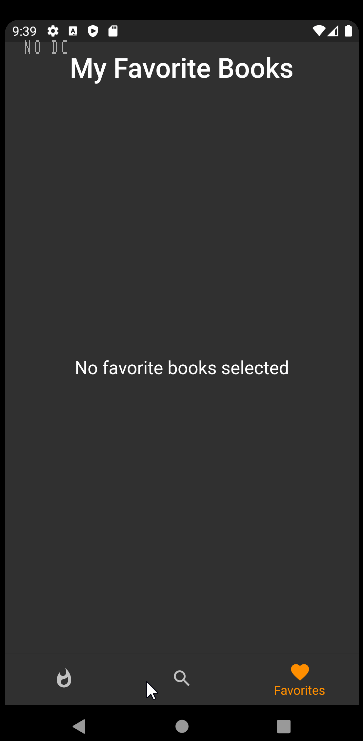

# Project find books

## Introduction 

This repository is the first part of the main project which aims to search books and find libraries containing them. I've decided to divide into 4 potential parts : 
- A flutter app that allows users to search books and display their details. 
- A flutter app that finds librairies using openstreetmap API.
- A Backend project that allows users to find which librairy has their selected book (and other similar books). Using geolocalisatiion.
- The complete project integrating the three parts (adding better UI and functionalities)

I'm also envisioning a fifth part to the project :
- Creating a recommendation system for the project.

## Project summary

``` 
Level : 1
Status : OnGoing
Hours spent : 17 hours 
```

## Book UI so far :

 


## Usecase flow of the main project

[Book_details.pdf](./assets/Book_details.pdf)


## TODO : (Chronological)

UI design : 

- [x] Create AppBar UI
- [x] Create SearchBar UI
- [x] Create a data mockup for book list.
- [x] Create a tags .
- [x] Create a BookListView
- [x] Create a Book Details screen
- [x] Create a Trending BookListView to view trending books (using the data mockup for now).
- [x] Create a favorites list of books.
- [ ] Create a Categories list.
- [x] Modify a display UI for the list of books.
- [ ] Refactor home.dart to use routes and different ways to handle the different widgets. 
- [ ] Remake the book details screen.

API : 
- [x] Create providers for http calls to google books api 
- [x] Create a converted for the json calls
- [ ] Handle not found screens.


## PROJECT BREAKDOWN STRUCTURE

- 110-000 An app : 
	- 111-000: An android/IOS For type of application.
		- 111-001: Deploy to android/IOS
	- 112-000: Flutter For framework.
		- 112-001: Design part of an application
	- 113-000: Dart For Programming language.
	- 114-000: Android studio/ Visual studio code For environement.
		- 114-001: Getting Started (Installing environement, paths)

- 120-000 Books UI :  
	- 121-000: API to fetch data
		- 121-001 How to fetch data?
	- 122-000: HomePage UI
		- 122-001: Appbar UI
		- 122-002: SearchBar UI
		- 122-003: getBooks UI
		- 122-004: getPopularBooks UI
	- 123-000: asynchronous calls -> response
		- 123-001: How to perform these calls ?
		- 123-002: What is the behavior of the async calls in Dart?
	- 124-000: Book List View UI
	- 125-000: Popular Book List View UI
	- 126-000: Book Info Screen UI
		- 126-001: Book model

- 130-000 Displays details : 
	- 131-000: Grid of cards displaying book results
		- 131-001: How to design a grid of cards?
		- 131-002: How to design the card? 
		- 131-003: What data to display on the results?
	- 132-000: OnClick : brings a new view of Book Details
		- 132-001: What design of the view would look like ?
		- 132-002: How to relate it to the previous view ?
	- 133-000: Book data comes mainly from the API called.
		- 133-001: Does it uses any other API?

